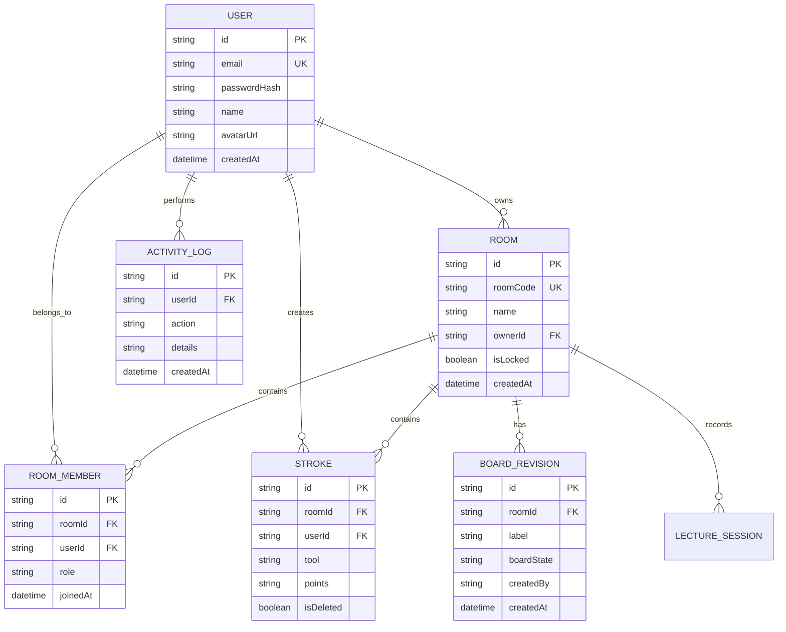

# 🚀 PRODUCTION ARCHITECTURE SPECIFICATION
## User Management, Whiteboard History, Access Control & Deployment System

---

## 1. Executive Summary

This document specifies the production architecture for upgrading the **Real-Time Collaborative Whiteboard Studio** from an anonymous room-based prototype into an enterprise-ready, multi-tenant collaboration platform with:

1. **Secure User Authentication & Session Persistence** (bcryptjs + JWT / HTTP-only cookies).
2. **User Workspaces & Personal Dashboard** (`/dashboard` with "My Whiteboards", "Shared With Me", "Recent Activity").
3. **User Profile Management** (`/profile` for account details and avatar customization).
4. **Room Ownership & RBAC Membership System** (`RoomMember` model with `HOST`, `EDITOR`, `VIEWER` roles).
5. **Persistent Stroke & Object History** linked to authenticated creator IDs.
6. **Board Checkpoints & Revisions** (saving and non-destructively restoring snapshots).
7. **Personal Activity Audit Logging** (`BOARD_CREATED`, `OBJECT_CREATED`, `OBJECT_UPDATED`, `OBJECT_DELETED`, `BOARD_SHARED`, `LECTURE_STARTED`, etc.).
8. **Authenticated Socket.IO Handshake** for real-time authorization.
9. **Dual Database Architecture** (SQLite for local development, PostgreSQL + Prisma for production).
10. **Production Cloud Deployment Specification** (Vercel Frontend + Persistent Node.js/Socket.IO Backend + PostgreSQL + S3 Storage).

---

## 2. System Component Topology

```
┌─────────────────────────────────────────────────────────────┐
│                    VERCEL HOSTED CLIENT                     │
│                (Next.js 16 + React 19 + Canvas)             │
│                                                             │
│   /login   /register   /dashboard   /profile   /whiteboard  │
└──────────────┬──────────────────────────────┬───────────────┘
               │                              │
     HTTPS REST API                  WSS Socket.IO + JWT Handshake
               │                              │
               ▼                              ▼
┌─────────────────────────────────────────────────────────────┐
│                 PERSISTENT NODE.JS BACKEND                  │
│            (Express 5 + Socket.IO 4 + Prisma ORM)           │
│                                                             │
│  ├── Auth Middleware (JWT/Session)                          │
│  ├── Access Control & Membership Validation                 │
│  ├── Object Upload & Asset Validation                       │
│  ├── Socket.IO Real-time Stroke Dispatch                    │
│  └── AI Lecture & Canvas Processing                         │
└──────────────┬──────────────────────────────┬───────────────┘
               │                              │
               ▼                              ▼
┌──────────────────────────────┐ ┌─────────────────────────────┐
│       POSTGRESQL / SQLITE    │ │    S3 / CLOUD OBJECT STORAGE │
│       (Prisma Database)      │ │    (Images & PDF Assets)    │
└──────────────────────────────┘ └─────────────────────────────┘
```

---

## 3. Data Model Architecture (Prisma Schema)



---

## 4. Security & Access Control Policy

| Operation | Requirement | Enforcement Layer |
|---|---|---|
| Register / Login | Public | Auth Controller |
| View Dashboard | Authenticated Session | Next.js Auth Guard + REST Middleware |
| Create Board | Authenticated User | REST `/api/rooms/create` |
| Join Socket.IO Room | Valid JWT Token + Room Membership | Socket.IO Handshake Middleware |
| Draw / Edit Objects | `EDITOR` or `HOST` role + Board unlocked | Socket.IO `canModifyBoard()` Guard |
| Change User Role | `HOST` role | Socket.IO & REST Auth Guard |
| Lock / Unlock Board | `HOST` role | Socket.IO & REST Auth Guard |
| Delete Board | Board `ownerId` | REST `/api/rooms/:roomCode` |

---

## 5. Deployment Architecture Specification

### Frontend Deployment (Vercel):
- **Framework**: Next.js 16 (App Router)
- **Environment Variables**:
  - `NEXT_PUBLIC_API_URL`: Target Express REST API (e.g. `https://api.whiteboard.io`)
  - `NEXT_PUBLIC_SOCKET_URL`: Target Socket.IO server (e.g. `https://api.whiteboard.io`)

### Backend Deployment (Persistent Node.js Instance - Railway / Render / DigitalOcean / AWS):
- **Runtime**: Node.js 20+ Express server with persistent WebSocket listener.
- **Environment Variables**:
  - `PORT`: Server port (default 4000)
  - `DATABASE_URL`: PostgreSQL connection string (`postgresql://...`)
  - `JWT_SECRET`: Secret key for token signing
  - `CLIENT_ORIGIN`: Allowed CORS domain (`https://whiteboard.io`)
  - `STORAGE_DRIVER`: `local` or `s3`
